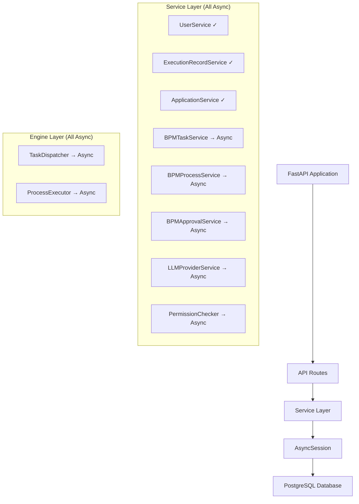

# Session异步迁移设计文档

## 概述

本设计文档描述了将项目中所有使用同步Session的服务迁移到AsyncSession的架构方案。当前项目已经建立了完整的异步数据库架构，但仍有部分服务使用同步Session，导致架构不一致性。本迁移将确保整个应用的异步一致性和性能优化。

## 架构

### 当前架构状态

**已正确实现的异步组件:**
- 数据库连接: 使用`create_async_engine`和`AsyncSessionLocal`
- 依赖注入: `get_session()`返回`AsyncSession`
- 核心服务: `UserService`, `ExecutionRecordService`, `ApplicationService`等已使用AsyncSession

**需要迁移的同步组件:**
- BPM服务: `BPMTaskService`, `BPMProcessService`, `BPMApprovalService`
- LLM服务: `LLMProviderService`
- 权限服务: `PermissionChecker`
- 引擎组件: `TaskDispatcher`, `ProcessExecutor`

### 目标架构



## 组件和接口

### 1. 服务层迁移模式

**标准异步服务模式:**
```python
from sqlmodel.ext.asyncio.session import AsyncSession
from sqlmodel import select

class ServiceName:
    def __init__(self, session: AsyncSession):
        self.session = session
    
    async def method_name(self) -> ReturnType:
        statement = select(Model).where(...)
        result = await self.session.execute(statement)
        return result.scalar_one_or_none()
```

### 2. BPM服务迁移接口

**BPMTaskService接口:**
```python
class BPMTaskService:
    def __init__(self, session: AsyncSession):
        self.session = session
        self.dispatcher = TaskDispatcher(session)
    
    async def create_task(self, data: TaskCreate) -> Task
    async def get_task(self, task_id: UUID) -> Optional[Task]
    async def update_task(self, task_id: UUID, data: TaskUpdate) -> Optional[Task]
    async def assign_task(self, task_id: UUID, assignee_id: UUID) -> bool
    async def complete_task(self, task_id: UUID, result: dict) -> bool
```

### 3. 引擎组件迁移接口

**TaskDispatcher接口:**
```python
class TaskDispatcher:
    def __init__(self, session: AsyncSession):
        self.session = session
    
    async def assign_task(self, task_id: UUID, assignee_id: UUID) -> None
    async def claim_task(self, task_id: UUID, user_id: UUID) -> None
    async def get_user_tasks(self, user_id: UUID, workspace_id: UUID, status: Optional[TaskStatus] = None) -> List[Task]
```

## 数据模型

现有数据模型无需修改，因为SQLModel模型本身支持异步和同步操作。迁移重点在于服务层的Session使用方式。

## 错误处理

### 迁移过程中的错误处理策略

1. **导入错误处理**: 确保所有文件正确导入AsyncSession
2. **方法签名错误**: 确保所有数据库操作方法都是async
3. **调用链错误**: 确保所有调用异步方法的地方都使用await
4. **测试兼容性**: 更新所有相关测试使用异步测试方法

## 测试策略

### 单元测试迁移

**测试模式更新:**
```python
import pytest
from sqlmodel.ext.asyncio.session import AsyncSession

@pytest.mark.asyncio
async def test_service_method(async_session: AsyncSession):
    service = ServiceName(async_session)
    result = await service.method_name()
    assert result is not None
```

### 集成测试更新

确保所有集成测试使用异步数据库会话和异步测试装饰器。

## 正确性属性

*属性是一个特征或行为，应该在系统的所有有效执行中保持为真——本质上是关于系统应该做什么的正式声明。属性作为人类可读规范和机器可验证正确性保证之间的桥梁。*

### 属性反思

在分析所有可测试的验收标准后，我发现了一些逻辑上冗余的属性，可以合并以提供更全面的验证：

- 属性1.1-1.5可以合并为一个全面的"服务异步一致性"属性
- 属性2.1-2.5可以合并为"BPM服务异步性"属性  
- 属性3.1-3.4可以合并为"LLM服务异步性"属性
- 属性4.1-4.4可以合并为"权限服务异步性"属性
- 属性5.1-5.5可以合并为"系统集成异步一致性"属性

### 核心正确性属性

**属性1: 服务异步一致性**
*对于任何*服务类文件，该服务应该使用AsyncSession类型注解，导入AsyncSession而非Session，并且所有数据库操作方法都应该是async def且使用await调用
**验证需求: 1.1, 1.2, 1.3, 1.4, 1.5**

**属性2: BPM服务异步性**
*对于任何*BPM相关服务(TaskService, ProcessService, ApprovalService)，所有数据库操作方法都应该是异步的，并且引擎组件(TaskDispatcher, ProcessExecutor)应该接收AsyncSession参数
**验证需求: 2.1, 2.2, 2.3, 2.4, 2.5**

**属性3: LLM服务异步性**
*对于任何*LLM提供商服务操作，包括创建、更新、删除和查询操作，都应该使用AsyncSession进行异步数据库访问并返回awaitable对象
**验证需求: 3.1, 3.2, 3.3, 3.4**

**属性4: 权限服务异步性**
*对于任何*权限检查操作，包括用户权限验证和团队成员权限检查，都应该使用AsyncSession进行异步数据库访问并返回awaitable对象
**验证需求: 4.1, 4.2, 4.3, 4.4**

**属性5: 系统集成异步一致性**
*对于任何*API端点、引擎组件、测试文件和服务间调用，都应该正确使用await关键字调用异步服务，并且依赖注入应该提供AsyncSession实例
**验证需求: 5.1, 5.2, 5.3, 5.4, 5.5**

### 测试策略

**双重测试方法要求**:

本设计文档指定单元测试和基于属性的测试方法。单元测试和属性测试是互补的，两者都必须包含：
- 单元测试验证特定示例、边缘情况和错误条件
- 属性测试验证应该在所有输入中保持的通用属性
- 它们一起提供全面的覆盖：单元测试捕获具体错误，属性测试验证一般正确性

**单元测试要求**:

单元测试通常涵盖：
- 演示正确行为的特定示例
- 组件之间的集成点
- 单元测试很有用，但避免写太多。属性测试的工作是处理大量输入的覆盖。

**基于属性的测试要求**:

- 模型必须为目标语言选择基于属性的测试库并在设计文档中指定它。模型不得从头实现基于属性的测试。
- 模型应该配置每个基于属性的测试运行至少100次迭代，因为属性测试过程是随机的。
- 模型必须用明确引用设计文档中正确性属性的注释标记每个基于属性的测试。
- 模型必须使用这种确切格式标记每个基于属性的测试：'**Feature: session-async-migration, Property {number}: {property_text}**'
- 每个正确性属性必须由单个基于属性的测试实现。
- 模型必须在设计文档的测试策略部分明确这些要求。

**基于属性的测试库**: Python的Hypothesis库将用于实现基于属性的测试，配置为每个测试运行最少100次迭代。

**测试标记格式**: 每个属性测试必须使用以下格式标记：
- `**Feature: session-async-migration, Property 1: 服务异步一致性**`
- `**Feature: session-async-migration, Property 2: BPM服务异步性**`
- 等等...