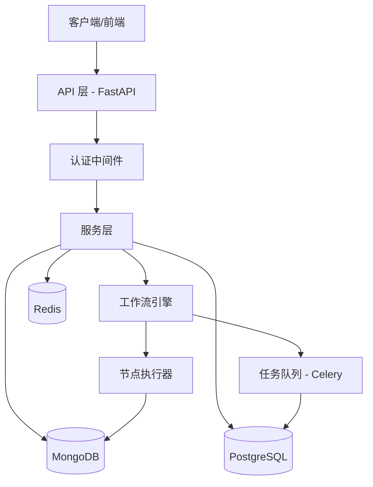
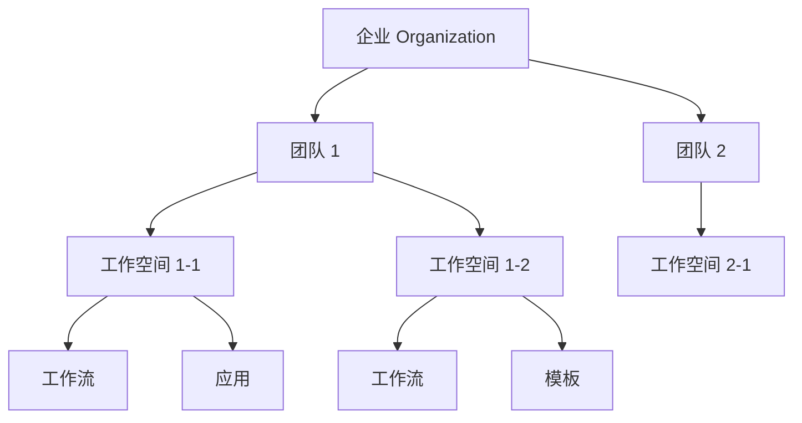

# 设计文档

## 概述

本系统是一个类似 Dify 的低代码平台后端，采用分层架构设计，支持多租户、工作流编排、AI 集成和 RESTful API 服务。系统使用 Python 作为主要开发语言，采用 FastAPI 框架构建 Web 服务，使用 SQLModel 作为 ORM 框架（结合了 SQLAlchemy 和 Pydantic 的优势），使用 PostgreSQL 作为主数据库存储结构化数据，MongoDB 存储用户上传的文件和非结构化数据，Redis 作为缓存和会话存储。

### 核心特性

- 多租户架构：支持企业、团队和工作空间的层级隔离
- 工作流引擎：基于 DAG 的可视化工作流编排和执行
- AI 集成：支持多种 LLM 提供商的统一接口
- 权限控制：基于角色的细粒度访问控制（RBAC）
- 可扩展性：插件化的节点系统，支持自定义节点类型

## 架构

### 系统架构图



### 分层架构

1. **API 层**: 处理 HTTP 请求，参数验证，响应序列化
2. **服务层**: 业务逻辑实现，事务管理
3. **数据访问层**: 数据库操作，ORM 映射
4. **工作流引擎层**: 工作流解析、调度和执行
5. **基础设施层**: 缓存、消息队列、日志、监控

### 多租户架构

系统采用三层租户隔离模型：**企业 (Organization) → 团队 (Team) → 工作空间 (Workspace)**

#### 租户层级关系



#### 数据隔离策略

1. **行级隔离 (Row-Level Isolation)**
   - 所有资源表包含 `workspace_id` 外键（Workspace 是资源隔离的租户单位）
   - 查询时自动添加 workspace 过滤条件
   - 使用 SQLModel 的查询过滤器实现

```python
# 示例：自动添加 workspace 过滤
from sqlmodel import select, Session
from typing import Type
from uuid import UUID

class WorkspaceFilter:
    def filter_by_workspace(self, session: Session, model: Type, workspace_id: UUID):
        statement = select(model).where(model.workspace_id == workspace_id)
        return session.exec(statement).all()
```

2. **权限隔离 (Permission Isolation)**
   - 用户通过 TeamMember 关联到团队
   - 每个用户在不同团队中可以有不同角色
   - 访问资源时验证用户在对应团队的权限

```python
# 权限检查流程
def check_access(user: User, resource: Resource) -> bool:
    workspace = resource.workspace
    team = workspace.team
    member = get_team_member(user, team)
    return member.role.has_permission(action)
```

3. **配置继承 (Configuration Inheritance)**
   - 企业级配置 → 团队级配置 → 工作空间级配置
   - 子级可以覆盖父级配置
   - 使用配置合并策略

```python
# 配置继承示例
def get_effective_config(workspace: Workspace) -> Dict:
    org_config = workspace.team.organization.settings
    team_config = workspace.team.settings
    workspace_config = workspace.settings
    return {**org_config, **team_config, **workspace_config}
```

#### 资源隔离范围

| 资源类型 | 隔离级别 | 租户字段 | 说明 |
|---------|---------|---------|------|
| 工作流 (Workflow) | 工作空间 | workspace_id | 每个工作流属于一个工作空间（租户） |
| 应用 (Application) | 工作空间 | workspace_id | 应用及其 API 端点按工作空间（租户）隔离 |
| 提示词模板 (Template) | 工作空间 | workspace_id | 模板在工作空间（租户）内共享 |
| LLM 提供商配置 | 工作空间 | workspace_id | API 密钥在工作空间（租户）级别配置 |
| 执行记录 (Execution) | 工作空间 | workflow_id → workspace_id | 通过工作流间接隔离到工作空间（租户） |
| 用户 (User) | 全局 | - | 用户可以属于多个团队 |
| 团队 (Team) | 企业 | organization_id | 团队属于企业或独立存在 |
| 工作空间 (Workspace) | 团队 | team_id | 工作空间属于团队 |

#### 跨租户操作

1. **资源移动**
   - 支持在同一团队的工作空间间移动资源
   - 验证用户在源和目标工作空间的权限
   - 更新资源的 workspace_id

2. **团队切换**
   - 用户可以在多个团队间切换
   - 切换时更新当前上下文（团队和工作空间）
   - 使用 JWT 令牌携带当前上下文信息

3. **企业级视图**
   - 企业管理员可以查看所有团队的资源
   - 使用聚合查询汇总统计信息
   - 保持数据隔离的同时提供全局视图

#### 租户上下文管理

```python
class TenantContext:
    """租户上下文，在请求生命周期中传递"""
    user: User
    current_team: Team
    current_workspace: Workspace
    
    def has_permission(self, resource: Resource, action: Action) -> bool:
        """检查当前用户是否有权限执行操作"""
        pass
    
    def filter_query(self, query: Query) -> Query:
        """自动添加租户过滤条件"""
        return query.filter(
            Model.workspace_id == self.current_workspace.id
        )
```

#### 数据库设计要点

1. **外键约束**: 所有资源表通过 workspace_id 外键关联到 workspace（租户隔离）
2. **索引优化**: 在 workspace_id 上创建索引加速租户查询
3. **级联删除**: 删除工作空间（租户）时级联删除所有资源
4. **唯一约束**: 资源名称在工作空间（租户）内唯一

```sql
-- 示例：工作流表的多租户设计
CREATE TABLE workflows (
    id UUID PRIMARY KEY,
    name VARCHAR(255) NOT NULL,
    workspace_id UUID NOT NULL REFERENCES workspaces(id) ON DELETE CASCADE,  -- 租户隔离字段
    -- 其他字段...
    UNIQUE(workspace_id, name),  -- 租户内名称唯一
    INDEX idx_workspace_id (workspace_id)  -- 加速租户查询
);

-- 说明：workspace_id 是资源隔离的租户标识符
-- 所有资源表都应包含此字段以实现多租户隔离
```

#### 安全考虑

1. **SQL 注入防护**: 使用 ORM 参数化查询
2. **越权访问防护**: 每次查询都验证 workspace_id
3. **数据泄露防护**: API 响应中不包含其他租户的数据
4. **审计日志**: 记录跨租户操作的审计日志

## 组件和接口

### 1. 认证和授权模块

#### 组件

- `AuthService`: 用户认证服务
- `TokenManager`: JWT 令牌管理
- `PermissionChecker`: 权限检查器

#### 接口

```python
class AuthService:
    def register(self, email: str, password: str) -> User:
        """注册新用户"""
        
    def login(self, email: str, password: str) -> TokenPair:
        """用户登录，返回访问令牌和刷新令牌"""
        
    def refresh_token(self, refresh_token: str) -> TokenPair:
        """刷新访问令牌"""
        
    def logout(self, token: str) -> None:
        """登出，撤销令牌"""
        
    def reset_password(self, email: str) -> None:
        """发送密码重置邮件"""

class PermissionChecker:
    def check_permission(self, user: User, resource: Resource, action: Action) -> bool:
        """检查用户是否有权限执行操作"""
        
    def get_user_role(self, user: User, workspace: Workspace) -> Role:
        """获取用户在工作空间中的角色"""
```

### 2. 用户和组织管理模块

#### 组件

- `UserService`: 用户管理服务
- `TeamService`: 团队管理服务
- `OrganizationService`: 企业管理服务
- `WorkspaceService`: 工作空间管理服务

#### 接口

```python
class TeamService:
    def create_team(self, name: str, creator: User) -> Team:
        """创建团队"""
        
    def invite_member(self, team: Team, email: str, role: Role) -> Invitation:
        """邀请成员加入团队"""
        
    def accept_invitation(self, invitation_token: str, user: User) -> TeamMember:
        """接受团队邀请"""
        
    def remove_member(self, team: Team, member: User) -> None:
        """移除团队成员"""
        
    def update_member_role(self, team: Team, member: User, new_role: Role) -> None:
        """更新成员角色"""

class WorkspaceService:
    def create_workspace(self, name: str, team: Team) -> Workspace:
        """创建工作空间"""
        
    def move_resource(self, resource: Resource, target_workspace: Workspace) -> None:
        """移动资源到另一个工作空间"""
```

### 3. 工作流管理模块

#### 组件

- `WorkflowService`: 工作流管理服务
- `WorkflowValidator`: 工作流验证器
- `WorkflowSerializer`: 工作流序列化器

#### 接口

```python
class WorkflowService:
    def create_workflow(self, name: str, workspace: Workspace) -> Workflow:
        """创建工作流"""
        
    def add_node(self, workflow: Workflow, node_config: NodeConfig) -> Node:
        """添加节点到工作流"""
        
    def connect_nodes(self, source: Node, target: Node) -> Connection:
        """连接两个节点"""
        
    def save_workflow(self, workflow: Workflow) -> None:
        """保存工作流"""
        
    def delete_workflow(self, workflow: Workflow) -> None:
        """删除工作流及其执行记录"""

class WorkflowValidator:
    def validate_workflow(self, workflow: Workflow) -> ValidationResult:
        """验证工作流完整性"""
        
    def check_cyclic_dependency(self, workflow: Workflow) -> bool:
        """检查是否存在循环依赖"""
        
    def validate_node_config(self, node: Node) -> ValidationResult:
        """验证节点配置"""
```

### 4. 工作流执行引擎

#### 组件

- `WorkflowEngine`: 工作流执行引擎
- `NodeExecutor`: 节点执行器
- `ExecutionContext`: 执行上下文
- `TopologicalSorter`: 拓扑排序器

#### 接口

```python
class WorkflowEngine:
    def execute(self, workflow: Workflow, inputs: Dict[str, Any]) -> ExecutionResult:
        """执行工作流"""
        
    def execute_async(self, workflow: Workflow, inputs: Dict[str, Any]) -> str:
        """异步执行工作流，返回执行 ID"""
        
    def get_execution_status(self, execution_id: str) -> ExecutionStatus:
        """获取执行状态"""

class NodeExecutor:
    def execute_node(self, node: Node, context: ExecutionContext) -> NodeResult:
        """执行单个节点"""
        
    def register_node_type(self, node_type: str, executor: Callable) -> None:
        """注册节点类型执行器"""
```

### 5. 节点类型实现

#### 组件

- `LLMNode`: LLM 调用节点
- `ConditionNode`: 条件判断节点
- `CodeNode`: 代码执行节点
- `HTTPNode`: HTTP 请求节点
- `TransformNode`: 数据转换节点

#### 接口

```python
class LLMNode:
    def execute(self, context: ExecutionContext) -> str:
        """调用 LLM 并返回结果"""
        
class ConditionNode:
    def execute(self, context: ExecutionContext) -> str:
        """评估条件并返回分支路径"""
        
class CodeNode:
    def execute(self, context: ExecutionContext) -> Any:
        """执行 Python 代码并返回结果"""
```

### 6. 提示词模板模块

#### 组件

- `PromptTemplateService`: 提示词模板服务
- `TemplateRenderer`: 模板渲染器

#### 接口

```python
class PromptTemplateService:
    def create_template(self, name: str, content: str, workspace: Workspace) -> PromptTemplate:
        """创建提示词模板"""
        
    def render_template(self, template: PromptTemplate, variables: Dict[str, Any]) -> str:
        """渲染模板"""
        
    def update_template(self, template: PromptTemplate, new_content: str) -> PromptTemplate:
        """更新模板并保留历史版本"""
```

### 7. LLM 提供商管理模块

#### 组件

- `LLMProviderService`: LLM 提供商管理服务
- `LLMClient`: LLM 客户端抽象
- `OpenAIClient`, `AnthropicClient`: 具体实现

#### 接口

```python
class LLMProviderService:
    def add_provider(self, name: str, api_key: str, workspace: Workspace) -> LLMProvider:
        """添加 LLM 提供商配置"""
        
    def get_models(self, provider: LLMProvider) -> List[str]:
        """获取提供商支持的模型列表"""
        
    def call_llm(self, provider: LLMProvider, model: str, prompt: str, **kwargs) -> str:
        """调用 LLM"""

class LLMClient(ABC):
    @abstractmethod
    def call(self, model: str, prompt: str, **kwargs) -> str:
        """调用 LLM"""
        
    @abstractmethod
    def list_models(self) -> List[str]:
        """列出支持的模型"""
```

### 8. 应用管理模块

#### 组件

- `ApplicationService`: 应用管理服务
- `APIKeyManager`: API 密钥管理器

#### 接口

```python
class ApplicationService:
    def create_application(self, name: str, workflow: Workflow) -> Application:
        """创建应用"""
        
    def publish_application(self, app: Application) -> str:
        """发布应用，返回 API 端点"""
        
    def call_application(self, app: Application, api_key: str, inputs: Dict) -> Any:
        """调用应用 API"""
```

### 9. 执行记录模块

#### 组件

- `ExecutionRecordService`: 执行记录服务

#### 接口

```python
class ExecutionRecordService:
    def create_record(self, workflow: Workflow, inputs: Dict, outputs: Dict) -> ExecutionRecord:
        """创建执行记录"""
        
    def get_records(self, workflow: Workflow, filters: Dict) -> List[ExecutionRecord]:
        """查询执行记录"""
        
    def cleanup_expired_records(self, retention_days: int) -> int:
        """清理过期记录"""
```

## 数据模型

### 用户和组织

```python
from sqlmodel import SQLModel, Field, Column, JSON
from typing import Optional
from datetime import datetime
from uuid import UUID, uuid4

class User(SQLModel, table=True):
    id: UUID = Field(default_factory=uuid4, primary_key=True)
    email: str = Field(unique=True, index=True)
    password_hash: str
    name: str
    avatar_url: Optional[str] = None
    created_at: datetime = Field(default_factory=datetime.utcnow)
    updated_at: datetime = Field(default_factory=datetime.utcnow)

class Organization(SQLModel, table=True):
    id: UUID = Field(default_factory=uuid4, primary_key=True)
    name: str
    description: Optional[str] = None
    created_by: UUID = Field(foreign_key="user.id")
    settings: dict = Field(default_factory=dict, sa_column=Column(JSON))  # 企业级别配置
    created_at: datetime = Field(default_factory=datetime.utcnow)
    updated_at: datetime = Field(default_factory=datetime.utcnow)

class Team(SQLModel, table=True):
    id: UUID = Field(default_factory=uuid4, primary_key=True)
    name: str
    organization_id: Optional[UUID] = Field(default=None, foreign_key="organization.id")
    description: Optional[str] = None
    settings: dict = Field(default_factory=dict, sa_column=Column(JSON))  # 团队级别配置
    created_by: UUID = Field(foreign_key="user.id")
    created_at: datetime = Field(default_factory=datetime.utcnow)
    updated_at: datetime = Field(default_factory=datetime.utcnow)

class TeamMember(SQLModel, table=True):
    id: UUID = Field(default_factory=uuid4, primary_key=True)
    team_id: UUID = Field(foreign_key="team.id")
    user_id: UUID = Field(foreign_key="user.id")
    role: str  # ADMIN, MEMBER, GUEST
    joined_at: datetime = Field(default_factory=datetime.utcnow)

class Workspace(SQLModel, table=True):
    id: UUID = Field(default_factory=uuid4, primary_key=True)
    name: str
    team_id: UUID = Field(foreign_key="team.id", index=True)
    description: Optional[str] = None
    settings: dict = Field(default_factory=dict, sa_column=Column(JSON))  # 工作空间级别配置
    created_by: UUID = Field(foreign_key="user.id")
    created_at: datetime = Field(default_factory=datetime.utcnow)
    updated_at: datetime = Field(default_factory=datetime.utcnow)
```

### 工作流

```python
from sqlmodel import Relationship
from typing import List

class Workflow(SQLModel, table=True):
    id: UUID = Field(default_factory=uuid4, primary_key=True)
    name: str
    workspace_id: UUID = Field(foreign_key="workspace.id", index=True)
    description: Optional[str] = None
    input_schema: dict = Field(default_factory=dict, sa_column=Column(JSON))
    output_schema: dict = Field(default_factory=dict, sa_column=Column(JSON))
    created_at: datetime = Field(default_factory=datetime.utcnow)
    updated_at: datetime = Field(default_factory=datetime.utcnow)
    
    # Relationships
    nodes: List["Node"] = Relationship(back_populates="workflow")
    connections: List["Connection"] = Relationship(back_populates="workflow")

class Node(SQLModel, table=True):
    id: UUID = Field(default_factory=uuid4, primary_key=True)
    workflow_id: UUID = Field(foreign_key="workflow.id", index=True)
    type: str  # LLM, CONDITION, CODE, HTTP, TRANSFORM
    name: str
    config: dict = Field(default_factory=dict, sa_column=Column(JSON))
    position: dict = Field(default_factory=dict, sa_column=Column(JSON))  # x, y coordinates
    
    # Relationships
    workflow: Optional[Workflow] = Relationship(back_populates="nodes")

class Connection(SQLModel, table=True):
    id: UUID = Field(default_factory=uuid4, primary_key=True)
    workflow_id: UUID = Field(foreign_key="workflow.id", index=True)
    source_node_id: UUID = Field(foreign_key="node.id")
    target_node_id: UUID = Field(foreign_key="node.id")
    source_output: str
    target_input: str
    
    # Relationships
    workflow: Optional[Workflow] = Relationship(back_populates="connections")
```

### 执行记录

```python
class ExecutionRecord(SQLModel, table=True):
    id: UUID = Field(default_factory=uuid4, primary_key=True)
    workflow_id: UUID = Field(foreign_key="workflow.id", index=True)
    inputs: dict = Field(default_factory=dict, sa_column=Column(JSON))
    outputs: Optional[dict] = Field(default=None, sa_column=Column(JSON))
    status: str  # PENDING, RUNNING, SUCCESS, FAILED
    error: Optional[str] = None
    started_at: datetime = Field(default_factory=datetime.utcnow)
    completed_at: Optional[datetime] = None
    duration_ms: Optional[int] = None
    
    # Relationships
    node_results: List["NodeExecutionResult"] = Relationship(back_populates="execution_record")

class NodeExecutionResult(SQLModel, table=True):
    id: UUID = Field(default_factory=uuid4, primary_key=True)
    execution_record_id: UUID = Field(foreign_key="executionrecord.id", index=True)
    node_id: UUID = Field(foreign_key="node.id")
    status: str
    inputs: dict = Field(default_factory=dict, sa_column=Column(JSON))
    outputs: Optional[dict] = Field(default=None, sa_column=Column(JSON))
    error: Optional[str] = None
    duration_ms: int
    
    # Relationships
    execution_record: Optional[ExecutionRecord] = Relationship(back_populates="node_results")
```

### 提示词模板

```python
class PromptTemplate(SQLModel, table=True):
    id: UUID = Field(default_factory=uuid4, primary_key=True)
    name: str
    workspace_id: UUID = Field(foreign_key="workspace.id", index=True)  # 租户隔离
    content: str
    variables: list = Field(default_factory=list, sa_column=Column(JSON))
    version: int = Field(default=1)
    created_by: UUID = Field(foreign_key="user.id")
    created_at: datetime = Field(default_factory=datetime.utcnow)
    updated_at: datetime = Field(default_factory=datetime.utcnow)
    
    # Relationships
    versions: List["PromptTemplateVersion"] = Relationship(back_populates="template")

class PromptTemplateVersion(SQLModel, table=True):
    id: UUID = Field(default_factory=uuid4, primary_key=True)
    template_id: UUID = Field(foreign_key="prompttemplate.id", index=True)
    version: int
    content: str
    created_at: datetime = Field(default_factory=datetime.utcnow)
    
    # Relationships
    template: Optional[PromptTemplate] = Relationship(back_populates="versions")
```

### LLM 提供商

```python
class LLMProvider(SQLModel, table=True):
    id: UUID = Field(default_factory=uuid4, primary_key=True)
    name: str
    workspace_id: UUID = Field(foreign_key="workspace.id", index=True)  # 租户隔离
    provider_type: str  # OPENAI, ANTHROPIC, etc.
    api_key_encrypted: str
    config: dict = Field(default_factory=dict, sa_column=Column(JSON))
    created_by: UUID = Field(foreign_key="user.id")
    created_at: datetime = Field(default_factory=datetime.utcnow)
    updated_at: datetime = Field(default_factory=datetime.utcnow)

# LLMModel 不需要持久化，作为配置类使用
class LLMModel(SQLModel):
    provider_type: str
    model_name: str
    max_tokens: int
    supports_streaming: bool
```

### 应用

```python
class Application(SQLModel, table=True):
    id: UUID = Field(default_factory=uuid4, primary_key=True)
    name: str
    workspace_id: UUID = Field(foreign_key="workspace.id", index=True)  # 租户隔离
    workflow_id: UUID = Field(foreign_key="workflow.id")
    api_key_hash: str
    endpoint: str
    is_published: bool = Field(default=False)
    config: dict = Field(default_factory=dict, sa_column=Column(JSON))
    created_by: UUID = Field(foreign_key="user.id")
    created_at: datetime = Field(default_factory=datetime.utcnow)
    updated_at: datetime = Field(default_factory=datetime.utcnow)
```

### 文件存储 (MongoDB)

```python
class UploadedFile:
    """存储在 MongoDB 中的文件元数据和内容"""
    id: ObjectId  # MongoDB 文档 ID
    file_id: UUID  # 业务层文件标识符
    workspace_id: UUID  # 租户隔离
    filename: str
    content_type: str
    size_bytes: int
    file_data: bytes  # 文件二进制内容（使用 GridFS 存储大文件）
    metadata: Dict[str, Any]  # 自定义元数据
    uploaded_by: UUID  # User ID
    created_at: datetime
    
class FileReference(SQLModel, table=True):
    """PostgreSQL 中的文件引用记录"""
    id: UUID = Field(default_factory=uuid4, primary_key=True)
    file_id: UUID = Field(unique=True, index=True)  # 关联到 MongoDB 中的文件
    workspace_id: UUID = Field(foreign_key="workspace.id", index=True)  # 租户隔离
    filename: str
    content_type: str
    size_bytes: int
    storage_type: str  # MONGODB, GRIDFS
    uploaded_by: UUID = Field(foreign_key="user.id")
    created_at: datetime = Field(default_factory=datetime.utcnow)
```

## 正确性属性

*属性是系统在所有有效执行中应该保持为真的特征或行为——本质上是关于系统应该做什么的形式化陈述。属性作为人类可读规范和机器可验证正确性保证之间的桥梁。*

### 认证和授权属性

**属性 1: 注册验证一致性**
*对于任何*注册请求，如果邮箱格式有效且密码强度符合要求，则系统应该成功创建用户账户
**验证: 需求 1.1**

**属性 2: 登录令牌生成**
*对于任何*有效的用户凭证，登录应该返回有效的访问令牌和刷新令牌
**验证: 需求 1.2**

**属性 3: 令牌刷新往返**
*对于任何*有效的刷新令牌，刷新操作应该返回新的有效访问令牌
**验证: 需求 1.4**

**属性 4: 登出令牌撤销**
*对于任何*已登录用户，登出后其访问令牌和刷新令牌应该被撤销且无法再使用
**验证: 需求 1.5**

### 用户管理属性

**属性 5: 资料更新持久化**
*对于任何*有效的资料更新请求，更新后查询用户资料应该返回新的信息
**验证: 需求 2.1**

**属性 6: 密码修改往返**
*对于任何*用户，修改密码后应该能使用新密码登录且旧密码失效
**验证: 需求 2.2**

**属性 7: 头像上传验证**
*对于任何*符合格式和大小要求的图片，上传应该成功并返回可访问的头像 URL
**验证: 需求 2.3**

**属性 8: 密码重置链接验证**
*对于任何*有效的重置链接，应该能成功设置新密码
**验证: 需求 2.5**

### 团队管理属性

**属性 9: 团队创建者权限**
*对于任何*新创建的团队，创建者应该自动拥有管理员角色
**验证: 需求 3.1**

**属性 10: 团队邀请接受**
*对于任何*有效的邀请令牌，接受后用户应该成为团队成员并拥有默认角色
**验证: 需求 3.3**

**属性 11: 成员移除权限撤销**
*对于任何*被移除的团队成员，移除后应该无法访问该团队的任何资源
**验证: 需求 3.4**

**属性 12: 角色更改立即生效**
*对于任何*成员角色更改，更改后立即查询权限应该反映新角色的权限
**验证: 需求 3.5**

### 企业管理属性

**属性 13: 企业创建者权限**
*对于任何*新创建的企业，创建者应该自动拥有企业管理员角色
**验证: 需求 4.1**

**属性 14: 团队继承企业配置**
*对于任何*在企业内创建的团队，应该继承企业的配置设置
**验证: 需求 4.2**

**属性 15: 企业配置传播**
*对于任何*企业级配置更新，所有关联团队应该应用新配置
**验证: 需求 4.3**

**属性 16: 使用统计汇总正确性**
*对于任何*企业，使用统计应该等于所有关联团队的资源使用总和
**验证: 需求 4.4**

**属性 17: 企业团队级联删除**
*对于任何*被删除的团队，该团队的所有资源应该被移除
**验证: 需求 4.5**

### 权限控制属性

**属性 18: 权限验证一致性**
*对于任何*资源访问请求，系统应该根据用户角色正确验证权限
**验证: 需求 5.1**

**属性 19: 未授权操作拒绝**
*对于任何*超出用户权限的操作，系统应该返回 403 状态码
**验证: 需求 5.2**

**属性 20: 管理员完全权限**
*对于任何*管理员角色用户，应该能对团队资源执行所有 CRUD 操作
**验证: 需求 5.3**

**属性 21: 成员权限限制**
*对于任何*成员角色用户，应该能创建和读取资源但不能删除
**验证: 需求 5.4**

**属性 22: 访客只读权限**
*对于任何*访客角色用户，应该只能读取公开资源
**验证: 需求 5.5**

### 工作空间属性

**属性 23: 工作空间资源关联**
*对于任何*在工作空间中创建的资源，应该关联到该工作空间
**验证: 需求 6.2**

**属性 24: 工作空间资源隔离**
*对于任何*工作空间切换，应该只显示当前工作空间的资源
**验证: 需求 6.3**

**属性 25: 资源移动更新关联**
*对于任何*资源移动操作，移动后资源应该关联到目标工作空间
**验证: 需求 6.4**

**属性 26: 工作空间级联删除**
*对于任何*被删除的工作空间，其所有关联资源应该被移除
**验证: 需求 6.5**

### 工作流管理属性

**属性 27: 工作流初始状态**
*对于任何*新创建的工作流，应该有唯一标识符和空的节点列表
**验证: 需求 7.1**

**属性 28: 节点配置验证**
*对于任何*添加到工作流的节点，其配置应该通过完整性验证
**验证: 需求 7.2**

**属性 29: 循环依赖检测**
*对于任何*节点连接操作，如果形成循环依赖则应该被拒绝
**验证: 需求 7.3**

**属性 30: 工作流序列化往返**
*对于任何*工作流，保存后加载应该得到等价的工作流对象
**验证: 需求 7.4, 15.1, 15.2**

**属性 31: 工作流删除级联**
*对于任何*被删除的工作流，其所有执行记录应该被移除
**验证: 需求 7.5**

### 工作流执行属性

**属性 32: 输入参数验证**
*对于任何*工作流执行请求，输入参数应该与工作流定义的输入变量匹配
**验证: 需求 8.1**

**属性 33: 拓扑排序执行顺序**
*对于任何*工作流执行，节点应该按照拓扑排序的顺序执行
**验证: 需求 8.2**

**属性 34: 节点数据传递**
*对于任何*节点执行，其输出应该正确传递给所有依赖节点
**验证: 需求 8.3**

**属性 35: 执行记录创建**
*对于任何*成功的工作流执行，应该创建包含输入输出的执行记录
**验证: 需求 8.4**

### 提示词模板属性

**属性 36: 模板语法验证**
*对于任何*提示词模板，创建时应该验证语法的正确性
**验证: 需求 9.1**

**属性 37: 变量占位符解析**
*对于任何*包含 {{variable_name}} 格式的模板，应该正确提取变量列表
**验证: 需求 9.2**

**属性 38: 模板渲染替换**
*对于任何*模板和变量值，渲染应该将所有占位符替换为对应的值
**验证: 需求 9.3**

**属性 39: 模板版本保留**
*对于任何*模板更新，应该保留历史版本且版本号递增
**验证: 需求 9.4**

**属性 40: 模板引用检查**
*对于任何*被工作流引用的模板，删除操作应该被阻止
**验证: 需求 9.5**

### LLM 提供商属性

**属性 41: 模型列表查询**
*对于任何*LLM 提供商，应该返回该提供商支持的模型列表
**验证: 需求 10.2**

**属性 42: LLM 调用重试**
*对于任何*失败的 LLM 调用，如果配置了重试则应该按配置重试
**验证: 需求 10.4**

**属性 43: 提供商引用检查**
*对于任何*被工作流引用的 LLM 提供商配置，删除操作应该被阻止
**验证: 需求 10.5**

### 执行记录属性

**属性 44: 执行记录查询**
*对于任何*工作流，查询应该返回该工作流的所有执行历史
**验证: 需求 11.1**

**属性 45: 执行记录完整性**
*对于任何*执行记录，应该包含输入参数、输出结果和所有节点的执行状态
**验证: 需求 11.2**

**属性 46: 时间范围筛选**
*对于任何*时间范围筛选，返回的记录应该都在指定时间范围内
**验证: 需求 11.4**

**属性 47: 过期记录清理**
*对于任何*超过保留期限的执行记录，清理操作应该将其移除
**验证: 需求 11.5**

### 应用管理属性

**属性 48: 应用工作流关联**
*对于任何*新创建的应用，应该正确关联到指定的工作流
**验证: 需求 12.1**

**属性 49: API 端点生成**
*对于任何*发布的应用，应该生成唯一的 API 端点
**验证: 需求 12.2**

**属性 50: API 密钥验证**
*对于任何*应用 API 调用，应该验证 API 密钥并执行关联的工作流
**验证: 需求 12.3**

**属性 51: 应用配置立即生效**
*对于任何*应用配置更新，更新后的 API 调用应该使用新配置
**验证: 需求 12.4**

**属性 52: 应用删除端点撤销**
*对于任何*被删除的应用，其 API 端点应该被撤销且无法访问
**验证: 需求 12.5**

### 节点类型属性

**属性 53: LLM 节点配置完整性**
*对于任何*LLM 节点，应该包含模型、提示词、温度和最大令牌数配置
**验证: 需求 13.1**

**属性 54: 条件节点分支路由**
*对于任何*条件节点，应该根据表达式评估结果选择正确的分支
**验证: 需求 13.2**

**属性 55: 代码节点执行**
*对于任何*代码节点，应该执行 Python 代码并返回结果
**验证: 需求 13.3**

**属性 56: 数据转换节点**
*对于任何*数据转换节点，应该正确提取 JSON 路径并转换数据格式
**验证: 需求 13.5**

### 数据持久化属性

**属性 57: 序列化完整性**
*对于任何*工作流序列化，应该包含所有节点配置、连接关系和元数据
**验证: 需求 15.3**

**属性 58: 反序列化验证**
*对于任何*JSON 反序列化，应该验证结构的完整性和正确性
**验证: 需求 15.4**

**属性 59: 数据迁移向后兼容**
*对于任何*旧版本的数据格式，应该能成功迁移到新版本
**验证: 需求 15.5**

### API 接口属性

**属性 60: API 请求验证**
*对于任何*API 请求，应该验证请求格式和认证信息
**验证: 需求 16.1**

**属性 61: API 成功响应格式**
*对于任何*成功的 API 请求，应该返回 JSON 格式响应和适当的 HTTP 状态码
**验证: 需求 16.2**

## 错误处理

### 错误类型

1. **验证错误**: 输入参数不符合要求
   - HTTP 400 Bad Request
   - 返回详细的验证错误信息

2. **认证错误**: 令牌无效或过期
   - HTTP 401 Unauthorized
   - 返回认证失败信息

3. **授权错误**: 用户无权限执行操作
   - HTTP 403 Forbidden
   - 返回权限不足信息

4. **资源不存在**: 请求的资源不存在
   - HTTP 404 Not Found
   - 返回资源未找到信息

5. **业务逻辑错误**: 违反业务规则
   - HTTP 422 Unprocessable Entity
   - 返回具体的业务错误信息

6. **外部服务错误**: LLM API 调用失败
   - HTTP 502 Bad Gateway
   - 记录详细错误并返回通用错误信息

7. **超时错误**: 请求处理超时
   - HTTP 504 Gateway Timeout
   - 返回超时信息

8. **服务器错误**: 未预期的系统错误
   - HTTP 500 Internal Server Error
   - 记录完整错误堆栈，返回通用错误信息

### 错误响应格式

```json
{
  "error": {
    "code": "VALIDATION_ERROR",
    "message": "输入参数验证失败",
    "details": [
      {
        "field": "email",
        "message": "邮箱格式不正确"
      }
    ],
    "request_id": "uuid"
  }
}
```

### 错误处理策略

1. **重试机制**: 对于临时性错误（如网络超时），实现指数退避重试
2. **熔断器**: 对于频繁失败的外部服务，实现熔断器模式
3. **降级策略**: 在部分功能不可用时，提供降级服务
4. **错误日志**: 记录所有错误的完整上下文信息
5. **用户友好**: 向用户返回清晰、可操作的错误信息

## 测试策略

### 单元测试

使用 pytest 作为测试框架，对以下组件进行单元测试：

1. **服务层**: 测试业务逻辑的正确性
2. **验证器**: 测试输入验证逻辑
3. **序列化器**: 测试数据序列化和反序列化
4. **工具函数**: 测试辅助函数的正确性

单元测试覆盖率目标: 80%

### 属性测试

使用 Hypothesis 作为属性测试库，对正确性属性进行验证：

1. **配置**: 每个属性测试运行至少 100 次迭代
2. **标注**: 每个属性测试必须使用注释标注对应的设计文档属性
   - 格式: `# Feature: low-code-platform-backend, Property X: <property_text>`
3. **生成器**: 为每种数据类型实现智能生成器
4. **覆盖**: 每个正确性属性必须有对应的属性测试

### 集成测试

使用 pytest 和 TestClient 进行 API 集成测试：

1. **API 端点**: 测试所有 REST API 端点
2. **工作流执行**: 测试端到端的工作流执行流程
3. **权限控制**: 测试不同角色的权限隔离
4. **数据库事务**: 测试事务的正确性和隔离性

### 测试数据

1. **Fixtures**: 使用 pytest fixtures 管理测试数据
2. **工厂模式**: 使用 factory_boy 创建测试对象
3. **数据库**: 使用 SQLite 内存数据库进行测试
4. **Mock**: 对外部服务（LLM API）使用 mock

### 性能测试

1. **负载测试**: 使用 Locust 进行负载测试
2. **基准测试**: 测试关键操作的性能基准
3. **数据库查询**: 使用 EXPLAIN 分析查询性能
4. **缓存效果**: 测试缓存的命中率和效果

## 技术栈

### 后端框架

- **FastAPI**: Web 框架，提供高性能的异步 API
- **SQLModel**: ORM 框架，结合了 SQLAlchemy 和 Pydantic 的优势
- **Alembic**: 数据库迁移工具

### 数据库

- **PostgreSQL**: 主数据库，存储结构化数据
- **Redis**: 缓存和会话存储

### 任务队列

- **Celery**: 异步任务队列
- **Redis**: 消息代理

### 认证

- **PyJWT**: JWT 令牌生成和验证
- **Passlib**: 密码哈希

### 测试

- **pytest**: 测试框架
- **Hypothesis**: 属性测试库
- **pytest-asyncio**: 异步测试支持
- **factory_boy**: 测试数据工厂

### LLM 集成

- **OpenAI Python SDK**: OpenAI API 客户端
- **Anthropic Python SDK**: Anthropic API 客户端
- **httpx**: HTTP 客户端

### 监控和日志

- **structlog**: 结构化日志
- **Prometheus**: 指标收集
- **Sentry**: 错误追踪

### 开发工具

- **Black**: 代码格式化
- **Ruff**: 代码检查
- **mypy**: 类型检查

## 部署架构

### 容器化

- 使用 Docker 容器化应用
- 使用 Docker Compose 进行本地开发
- 使用 Kubernetes 进行生产部署

### 服务组件

1. **API 服务**: FastAPI 应用，处理 HTTP 请求
2. **Worker 服务**: Celery worker，处理异步任务
3. **PostgreSQL**: 主数据库，存储结构化数据
4. **MongoDB**: 文档数据库，存储用户上传的文件（使用 GridFS 处理大文件）
5. **Redis**: 缓存和消息队列
6. **Nginx**: 反向代理和负载均衡

### 扩展性

- API 服务水平扩展，支持多实例
- Worker 服务根据队列长度自动扩展
- 数据库使用读写分离和分片
- Redis 使用集群模式

### 安全性

1. **HTTPS**: 所有 API 使用 HTTPS
2. **密钥管理**: 使用环境变量或密钥管理服务
3. **SQL 注入防护**: 使用 ORM 参数化查询
4. **XSS 防护**: 输入验证和输出转义
5. **CORS**: 配置跨域资源共享策略
6. **速率限制**: API 请求速率限制

## 性能优化

### 数据库优化

1. **索引**: 为常用查询字段添加索引
2. **连接池**: 使用数据库连接池
3. **查询优化**: 避免 N+1 查询问题
4. **分页**: 大数据集使用游标分页

### 缓存策略

1. **用户会话**: 缓存用户会话信息
2. **工作流定义**: 缓存工作流配置
3. **LLM 响应**: 缓存相同输入的 LLM 响应
4. **权限信息**: 缓存用户权限信息

### 异步处理

1. **工作流执行**: 长时间运行的工作流异步执行
2. **邮件发送**: 异步发送邮件
3. **日志写入**: 异步写入日志
4. **统计计算**: 异步计算使用统计

### 资源管理

1. **连接池**: 限制数据库和 Redis 连接数
2. **超时设置**: 为所有外部调用设置超时
3. **内存限制**: 限制单个请求的内存使用
4. **并发控制**: 限制并发执行的工作流数量

## 文件存储架构

### MongoDB 文件存储策略

系统使用 MongoDB 存储用户上传的文件，支持两种存储方式：

1. **小文件存储** (< 16MB)
   - 直接存储在 MongoDB 文档的 BSON 字段中
   - 适合头像、小图片、配置文件等

2. **大文件存储** (>= 16MB)
   - 使用 GridFS 分块存储
   - 适合视频、大型数据集、模型文件等

### 文件存储数据模型

```python
# MongoDB 集合
class UploadedFile:
    """存储在 MongoDB 中的文件"""
    _id: ObjectId  # MongoDB 文档 ID
    file_id: str  # UUID 格式的业务标识符
    workspace_id: str  # 租户隔离
    filename: str
    content_type: str
    size_bytes: int
    file_data: Binary  # 小文件直接存储
    gridfs_id: Optional[ObjectId]  # 大文件的 GridFS ID
    metadata: dict  # 自定义元数据
    uploaded_by: str  # User ID
    created_at: datetime
    
# PostgreSQL 表（文件引用）
class FileReference(SQLModel, table=True):
    id: UUID = Field(default_factory=uuid4, primary_key=True)
    file_id: UUID = Field(unique=True, index=True)  # 关联到 MongoDB
    workspace_id: UUID = Field(foreign_key="workspace.id", index=True)  # 租户隔离
    filename: str
    content_type: str
    size_bytes: int
    storage_type: str  # MONGODB, GRIDFS
    mongo_id: str  # MongoDB _id
    uploaded_by: UUID = Field(foreign_key="user.id")
    created_at: datetime = Field(default_factory=datetime.utcnow)
```

### 文件管理组件

```python
class FileStorageService:
    """文件存储服务"""
    
    def upload_file(
        self, 
        file: UploadFile, 
        context: TenantContext
    ) -> FileReference:
        """上传文件到 MongoDB，自动选择存储策略"""
        
    def download_file(
        self, 
        file_id: UUID, 
        context: TenantContext
    ) -> Tuple[bytes, str]:
        """下载文件，返回文件内容和 content_type"""
        
    def delete_file(
        self, 
        file_id: UUID, 
        context: TenantContext
    ) -> None:
        """删除文件，同时清理 MongoDB 和 PostgreSQL 记录"""
        
    def list_files(
        self, 
        context: TenantContext, 
        filters: Dict
    ) -> List[FileReference]:
        """列出当前工作空间的文件"""
        
    def get_file_url(
        self, 
        file_id: UUID, 
        context: TenantContext
    ) -> str:
        """生成文件下载 URL"""

class MongoDBClient:
    """MongoDB 客户端封装"""
    
    def store_small_file(
        self, 
        file_data: bytes, 
        metadata: Dict
    ) -> ObjectId:
        """存储小文件"""
        
    def store_large_file(
        self, 
        file_data: bytes, 
        filename: str, 
        metadata: Dict
    ) -> ObjectId:
        """使用 GridFS 存储大文件"""
        
    def retrieve_file(
        self, 
        file_id: ObjectId
    ) -> bytes:
        """检索文件"""
        
    def delete_file(
        self, 
        file_id: ObjectId
    ) -> None:
        """删除文件"""
```

### 文件访问权限

文件访问遵循租户隔离原则：

1. **上传权限**: 用户必须有当前工作空间的写权限
2. **下载权限**: 用户必须有文件所属工作空间的读权限
3. **删除权限**: 用户必须有文件所属工作空间的删除权限
4. **跨租户隔离**: 用户无法访问其他工作空间的文件

### 文件存储优化

1. **分片策略**: 按 workspace_id 分片，提高查询性能
2. **索引优化**: 在 workspace_id 和 file_id 上创建索引
3. **缓存策略**: 对频繁访问的小文件进行 Redis 缓存
4. **清理策略**: 定期清理未引用的孤立文件

## 技术栈

### 后端框架

- **FastAPI**: Web 框架，提供高性能的异步 API
- **Pydantic**: 数据验证和序列化
- **SQLAlchemy**: ORM 框架
- **Alembic**: 数据库迁移工具

### 数据库

- **PostgreSQL**: 主数据库，存储结构化数据
- **MongoDB**: 文档数据库，存储用户上传的文件
  - **PyMongo**: MongoDB Python 驱动
  - **Motor**: 异步 MongoDB 驱动
  - **GridFS**: 大文件存储
- **Redis**: 缓存和会话存储

### 任务队列

- **Celery**: 异步任务队列
- **Redis**: 消息代理

### 认证

- **PyJWT**: JWT 令牌生成和验证
- **Passlib**: 密码哈希
- **Bcrypt**: 密码加密算法

### 测试

- **pytest**: 测试框架
- **Hypothesis**: 属性测试库
- **pytest-asyncio**: 异步测试支持
- **factory_boy**: 测试数据工厂
- **mongomock**: MongoDB 测试 mock

### LLM 集成

- **OpenAI Python SDK**: OpenAI API 客户端
- **Anthropic Python SDK**: Anthropic API 客户端
- **httpx**: HTTP 客户端

### 文件处理

- **python-multipart**: 文件上传处理
- **Pillow**: 图片处理
- **python-magic**: 文件类型检测

### 监控和日志

- **structlog**: 结构化日志
- **Prometheus**: 指标收集
- **Sentry**: 错误追踪

### 开发工具

- **Black**: 代码格式化
- **Ruff**: 代码检查
- **mypy**: 类型检查
