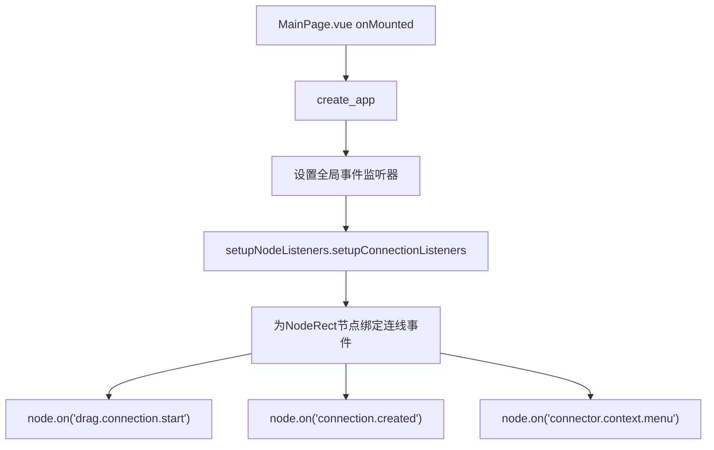
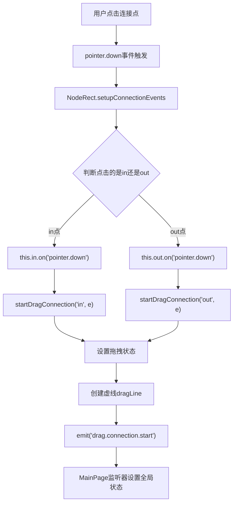
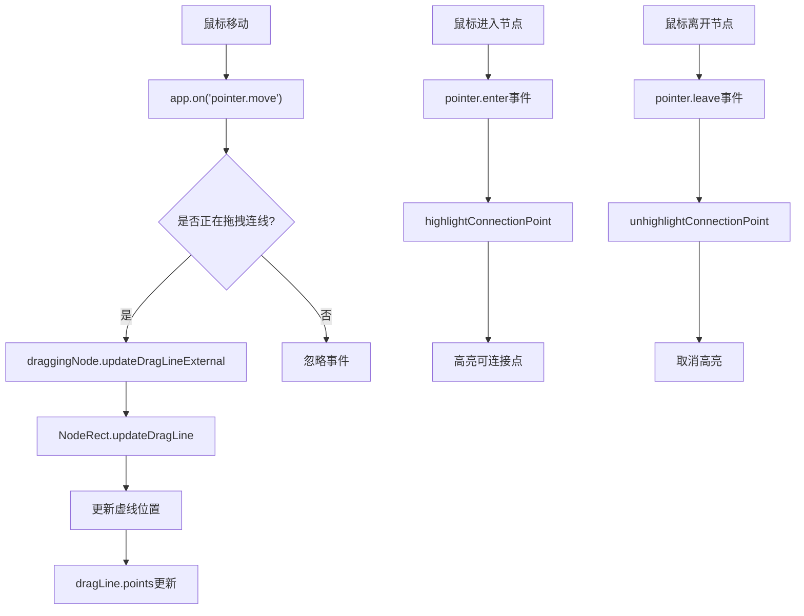
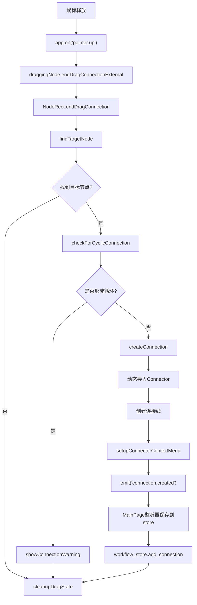
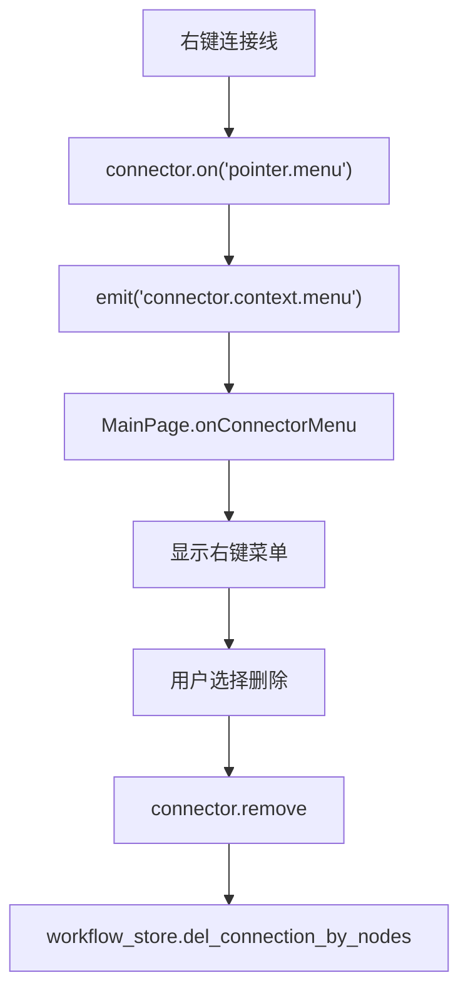

# NodeRect连线功能方法调用流程图

## 1. 初始化阶段

## 2. 连线开始阶段

## 3. 拖拽过程阶段

## 4. 连线完成阶段

## 5. 连线删除阶段

## 6. 核心方法调用序列

### 连线创建完整流程

1. **事件绑定**: `setupConnectionEvents()` → 为in/out点绑定pointer.down事件
2. **开始拖拽**: `startDragConnection()` → 设置状态、创建虚线、触发事件
3. **拖拽更新**: `updateDragLine()` → 实时更新虚线位置
4. **结束拖拽**: `endDragConnection()` → 查找目标、检查循环、创建连接
5. **创建连接**: `createConnection()` → 导入Connector、创建连线、设置事件
6. **保存状态**: MainPage监听器 → `workflow_store.add_connection()`

### 关键状态管理

- `isDragging`: 是否正在拖拽
- `dragStartPoint`: 拖拽起始点('in'/'out')
- `dragLine`: 拖拽时的虚线对象
- `isDraggingConnection`: 全局拖拽状态(MainPage)
- `draggingNode`: 当前拖拽的节点(MainPage)

### 循环检测机制

`checkForCyclicConnection()` 方法通过遍历现有连接，检查是否存在反向连接来防止循环。

### 事件传播控制

使用 `e.stopDefault()` 和 `e.stop()` 防止与编辑器的默认行为冲突。
